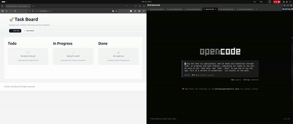
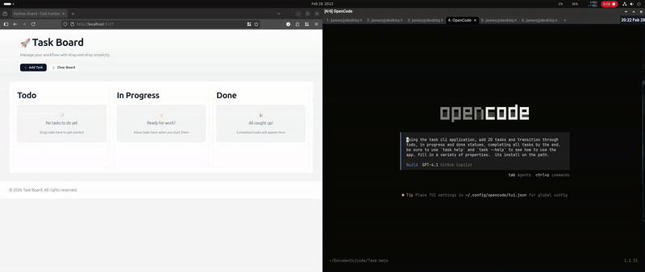
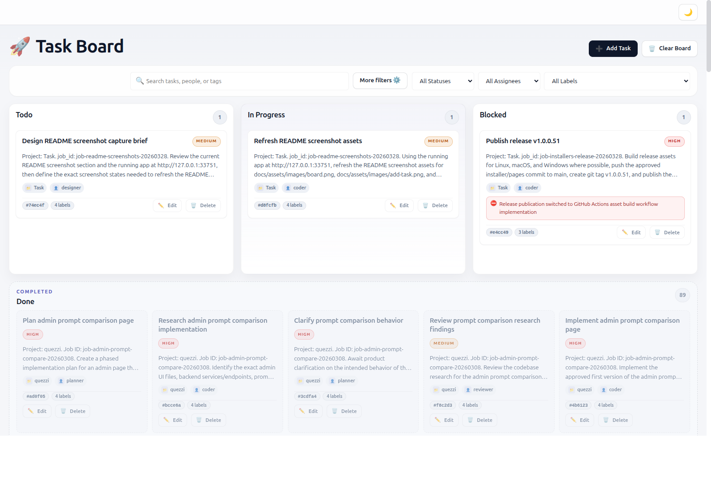
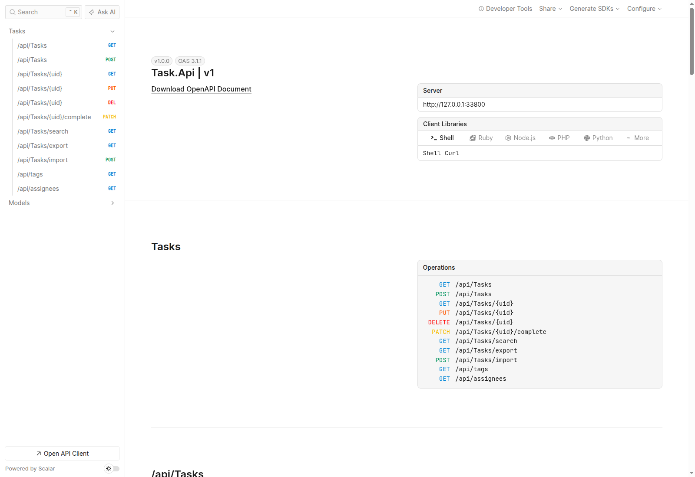

# Task Management System

> **Build workflows for both humans and LLM/AI agents—without SaaS limits.**
>
> Modern teams (and their coding agents or LLMs) need a task platform that’s open, and agent-friendly.
>
> Tired of apps that lock you in and don’t talk to your automations or agents? This system gives you:
>
> - A developer-first CLI—ideal for scripts, automations, and LLM agents
> - A human-friendly Kanban web UI for drag-and-drop workflow
> - A robust API for LLM agents and bots to create, search, assign, and complete tasks automatically
> - Full data ownership, privacy by default, and no vendor lock-in
> - Machine-readable outputs and clear error handling—built for agent resilience
>
> **Let your team—and your AI agents—manage work together in the terminal, browser, or with code. Get started below!**

[](LICENSE)

A cross-platform task management system with a robust CLI client (API-only), REST API backend, and persistent storage for advanced task management.

## Demo Video

Check out a demo of the Task Management System in action:

<!--  -->


## Screenshots

### Kanban Board


### Add Task Modal


### API Overview



## Architecture Overview

The project is structured around a clear separation of concerns for usability, automation, and scalability. Here is a high-level architecture:

```
                        +------------------------+
                        |    User/Developer      |
                        |  (CLI & Browser)       |
                        +-----------+------------+
                                    |
                 +------------------+-------------------+
                 |                                      |
         +-------v--------+                      +-------v---------+
         |     CLI        |                      |    Web UI       |
         |   (Task.Cli)   |                      | (Kanban Razor)  |
         +-------+--------+                      +-------+---------+
                 |                                      |
   (API mode: HTTP via API—CLI requires remote API)    |
                 |                            [Server-side, accesses]
         +-------v--------+                  +---------+-------------+
         |     API        |<----------------+   Task.Api (Razor)    |
         |   (Task.Api)   |   [shared logic & direct DB access]     |
         +-------+--------+                  +---------+-------------+
                 |                                      |
                 +------------------v-------------------+
                                 SQLite DB
                          (tasks, tags, FTS, etc)
```
**Legend:**
- **CLI**: Command-line tool (`Task.Cli`) — connects exclusively to the API with HTTP (API mode).
- **Web UI**: Kanban board (Razor pages) — accesses data directly using Task.Core logic (no HTTP/REST).
- **API**: REST backend (`Task.Api`) — serves the CLI in API mode and remote services; also hosts Razor pages.
- **SQLite DB**: The backend (Task.Api) stores data in SQLite. The CLI communicates with the API and does not access SQLite directly.

The system consists of three main components:

- **CLI Client** (`Task.Cli/`): A command-line interface for managing tasks
- **REST API Backend** (`Task.Api/`): A web API server providing REST endpoints and Kanban Board Web UI
- **Storage**: The backend uses an SQLite database with full-text search and vector search capabilities

## Features

### CLI Features
- Add, list, edit, delete, and complete tasks
- Assign tasks to users/assignees
- Search tasks (full-text and semantic search)
- Import tasks
- JSON output for scripting and integration
- Plain text output option

- API integration mode (--api-url)

### API Features
- RESTful endpoints for task management
- Scalar/OpenAPI documentation
- CORS support for web integrations
- Advanced filtering and sorting
- Tag management
- JSON serialization with custom converters

### Storage Features
- The backend database (SQLite) includes schema for FTS5 and vector search
- Automatic schema migration
- Optimized indexes for performance
- Support for tags, priorities, due dates, assignees
- Full-text search on title, description, and tags
- Vector search for semantic similarity (requires sqlite-vss extension)

## Project Links

- [LICENSE](LICENSE)
- [CONTRIBUTING](CONTRIBUTING.md)
- [CODE_OF_CONDUCT](CODE_OF_CONDUCT.md)
- [CHANGELOG](CHANGELOG.md)

## Installation

### CLI Installation

#### Self-Contained Single File Executables

Download the appropriate single executable for your platform from the releases page. Each executable is self-contained, including the .NET runtime and all dependencies, making it easy to distribute and run without additional setup.

- **Linux x64**: `Task.Cli` (single executable file, ~17MB)
- **macOS Intel**: `Task.Cli` (single executable file)
- **macOS ARM64**: `Task.Cli` (single executable file)
- **Windows x64**: `Task.Cli.exe` (single executable file)

##### Installation Steps

1. **Download**: Download the executable for your platform from the [releases page](link-to-releases).

2. **Make Executable (Linux/macOS only)**: After downloading, make the file executable:
   ```bash
    chmod +x Task.Cli
    ```

3. **Install to PATH (Recommended)**: To use the `task` command from anywhere, move the executable to a directory in your system's PATH:
    - On Linux/macOS: Move to `/usr/local/bin/` (requires sudo) or `~/bin/` (create if needed):
      ```bash
      sudo mv Task.Cli /usr/local/bin/task
      # or
      mkdir -p ~/bin && mv Task.Cli ~/bin/task
      ```
     Ensure `~/bin` is in your PATH by adding to your shell profile (e.g., `~/.bashrc` or `~/.zshrc`):
     ```bash
     PATH="$HOME/bin:$PATH"
     ```
   - On Windows: Move `Task.exe` to a directory in your PATH, such as `C:\Windows\System32\` or create a custom directory and add it to PATH via System Properties > Environment Variables.

4. **Verify Installation**: Open a new terminal and run:
    ```bash
    task --help
    ```

To run without installing to PATH, simply execute the file from its download location.

---

## CLI Command Reference

The output below shows all available global options and commands for the CLI:

```text
USAGE:
    task [OPTIONS] <COMMAND>

EXAMPLES:
    task add Buy groceries
    task add --title Refactor code --priority high --tags code,refactor
    task add --title Upload report --due-date 2024-04-01
    task add --title Team meeting --project work --status in_progress
    task add Buy groceries --priority high --assignee john.doe --tags errands 
    --due-date 2026-03-01

OPTIONS:
    -h, --help       Prints help information   
    -v, --version    Prints version information

COMMANDS:
    add               Create a new task with optional properties like priority, 
                      due date, tags, and project assignment                    
    list              Display tasks with advanced filtering by status, priority,
                      assignee, project, tags, and due date                     
    edit <ids>        Modify existing task properties including title,          
                      description, priority, due date, and assignee             
    delete            Permanently remove one or more tasks (supports bulk       
                      deletion with confirmation)                               
    complete          Mark tasks as completed (supports bulk completion)        
    reset <id>        Reset a completed task back to pending status             
    search <query>    Perform full-text or semantic similarity search across    
                      task titles and descriptions                              
    import            Import tasks from JSON or CSV files, merging with existing
                      data                                                      
    config            Manage CLI configuration settings                         
    help              Show detailed help information                            
```

---


#### Building CLI from Source

Requirements:
- .NET 10.0 SDK

Clone the repository and build:

```bash
git clone <repository-url>
cd Task
dotnet build Task.Cli/Task.Cli.csproj -c Release
```

To publish single-file executables:

```bash
cd Task.Cli

# Linux
dotnet publish -c Release -r linux-x64 --self-contained -p:PublishSingleFile=true -p:PublishTrimmed=true

# macOS Intel
dotnet publish -c Release -r osx-x64 --self-contained -p:PublishSingleFile=true -p:PublishTrimmed=true

# macOS ARM64
dotnet publish -c Release -r osx-arm64 --self-contained -p:PublishSingleFile=true -p:PublishTrimmed=true

# Windows
dotnet publish -c Release -r win-x64 --self-contained -p:PublishSingleFile=true -p:PublishTrimmed=true
```

Run the CLI application:

```bash
./Task.Cli --help
```

### API Backend Installation

#### Running via Docker Compose (Recommended)

The easiest way to run the API backend is using Docker Compose:

1. Ensure Docker and Docker Compose are installed on your system.

2. From the project root directory, run:
   ```bash
   docker-compose up -d
   ```

   This will:
   - Build the API Docker image
   - Start the API server on port 8080
   - Mount a `./data` directory for persistent SQLite database storage

3. Verify the API is running:
   - API endpoints: http://localhost:8080/api/tasks
   - Scalar UI: http://localhost:8080/scalar

4. To stop the services:
   ```bash
   docker-compose down
   ```

#### Building and Running API from Source

Requirements:
- .NET 10.0 SDK

1. Navigate to the API directory:
   ```bash
   cd Task.Api
   ```

2. Restore dependencies and run:
   ```bash
   dotnet run
   ```

The API will start on http://localhost:5000 (development) or https://localhost:5001 (with SSL).

For production deployment, configure the `ASPNETCORE_ENVIRONMENT` and `DatabasePath` settings.

## Usage

### CLI Usage

The CLI requires a remote Task API server and operates in API mode only. All commands communicate with the backend API via the `--api-url` option.

#### Basic Commands

Add a task:
```bash
task add "Buy groceries" --api-url http://localhost:8080
# or set the API URL once with:
task config set api-url http://localhost:8080
# then use:
task add "Review code" --assignee john.doe --priority high
```

List tasks:
```bash
task list
task list --assignee john.doe --status todo
```

Complete a task:
```bash
task complete a2b3k9
```

Edit a task:
```bash
task edit 1 "Buy groceries and milk"
task edit 1 --assignee jane.smith
```

Delete a task:
```bash
task delete 1
```

Search tasks:
```bash
task search "groceries"
```

#### Options

- `--json`: Output in JSON format
- `--plain`: Plain text output
- `--api-url <url>`: Base URL of the Task API (required)

#### Examples

List tasks in JSON:
```bash
task list --json
```

Connect to API backend:
```bash
task --api-url http://localhost:8080 list
```

### API Usage

The API provides REST endpoints for task management. When running locally, access:

- **Scalar UI**: http://localhost:8080/scalar (when using Docker) or http://localhost:5000/scalar (development)
- **API Base URL**: http://localhost:8080/api (Docker) or http://localhost:5000/api (development)

#### Key Endpoints

- `GET /api/tasks` - List all tasks with optional filtering
- `GET /api/tasks/{uid}` - Get a specific task by UID
- `POST /api/tasks` - Create a new task
- `PUT /api/tasks/{uid}` - Update a task
- `DELETE /api/tasks/{uid}` - Delete a task
- `PATCH /api/tasks/{uid}/complete` - Mark task as completed
- `GET /api/tasks/search?q={query}&type={fts|semantic}` - Search tasks
- `GET /api/tags` - Get all unique tags

#### API Examples

Create a task:
```bash
curl -X POST http://localhost:8080/api/tasks \
  -H "Content-Type: application/json" \
  -d '{"title": "New Task", "priority": "high"}'
```

List tasks:
```bash
curl http://localhost:8080/api/tasks
```

## Database

The backend application uses SQLite for data storage with an advanced schema supporting:

- **Tasks Table**: Core task data with priorities, due dates, tags, and status
- **FTS5 Virtual Table**: Full-text search across title, description, and tags
- **VSS Virtual Table**: Vector search for semantic similarity (requires sqlite-vss extension)
- **Triggers**: Automatic synchronization between tables
- **Indexes**: Optimized for common query patterns

The SQLite database file is created automatically on the backend. In Docker deployments, it's stored in the `./data` directory for persistence.

### Database Schema

See `SCHEMA.sql` (in the backend source) for the complete database schema definition.

## Demo Video

Check out a demo of the Task Management System in action:

[▶️ Watch the demo video](docs/assets/videos/TaskViaAI.mp4)

Most browsers will play the video in-page or download it directly.

---

<!-- Demo video and screenshots moved to top for better visibility -->
