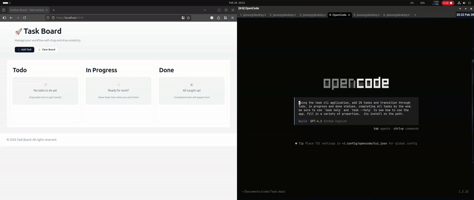
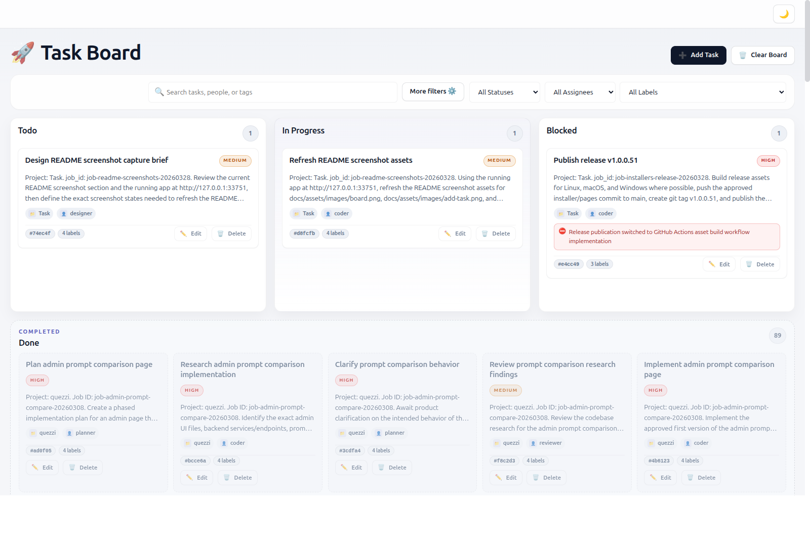
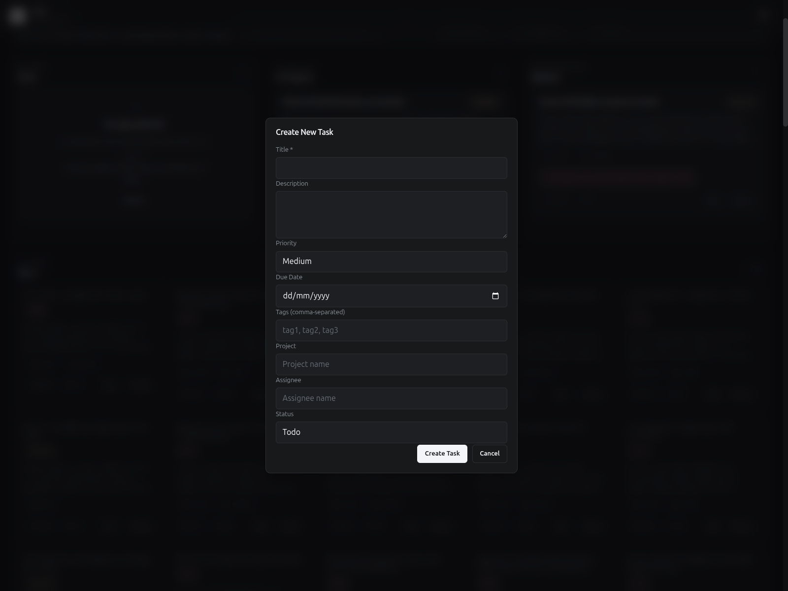
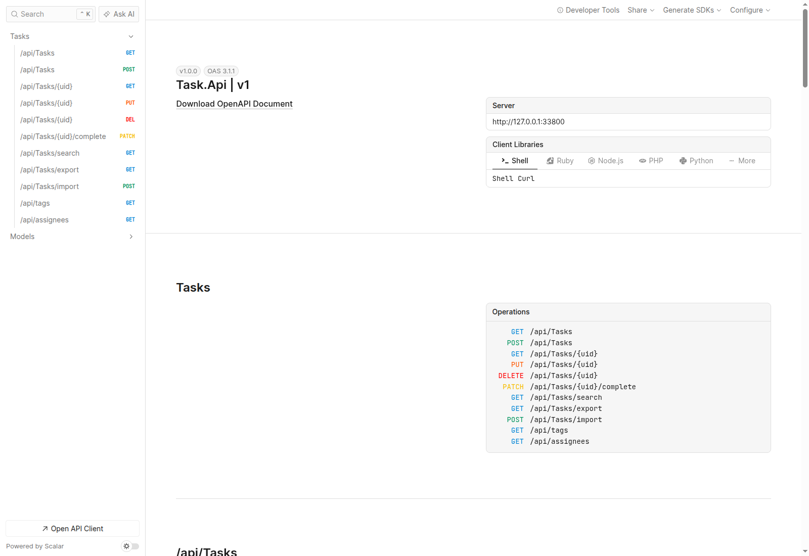

# Task Management System

> **Let your team—and your AI agents—manage work together in the terminal, browser, or with code. Get started below!**

[](LICENSE)
[](https://jmkelly.github.io/task/)

A cross-platform task management system with a robust CLI client (API-only), REST API backend, and persistent storage for advanced task management.

---

## Demo



### Kanban Board


### Add Task Modal


### API Overview


---

## Features

### CLI Features
- Add, list, edit, delete, and complete tasks
- Assign tasks to users/assignees
- Search tasks (full-text and semantic search)
- Import tasks
- JSON output for scripting and integration
- Plain text output option
- API integration mode (--api-url)

### API Features
- RESTful endpoints for task management
- Scalar/OpenAPI documentation
- CORS support for web integrations
- Advanced filtering and sorting
- Tag management
- JSON serialization with custom converters

### Storage Features
- The backend database (SQLite) includes schema for FTS5 and vector search
- Automatic schema migration
- Optimized indexes for performance
- Support for tags, priorities, due dates, assignees
- Full-text search on title, description, and tags
- Vector search for semantic similarity (requires sqlite-vss extension)

---

## Quick Installation

### Using the Installer Script (Recommended)

The fastest way to install the Task CLI is with the one-line installer. Open a terminal and run the command for your platform:

**macOS:**
```bash
curl -fsSL https://jmkelly.github.io/task/installers/task-install-macos.sh | bash
```

**Linux:**
```bash
curl -fsSL https://jmkelly.github.io/task/installers/task-install-linux.sh | bash
```

**Windows (PowerShell):**
```powershell
irm https://jmkelly.github.io/task/installers/task-install-windows.ps1 | iex
```

The installer automatically downloads the latest release for your platform and places the `task` binary in `~/.local/bin` (macOS/Linux) or `%LOCALAPPDATA%\Task\bin` (Windows). After installation, open a new terminal and run `task --help` to verify.

### Manual Download

If you prefer to install manually, download the appropriate self-contained executable for your platform from the [releases page](https://github.com/jmkelly/task/releases). Each executable includes the .NET runtime and all dependencies.

- **Linux x64**: `Task.Cli` (single executable file, ~17MB)
- **macOS Intel**: `Task.Cli` (single executable file)
- **macOS ARM64**: `Task.Cli` (single executable file)
- **Windows x64**: `Task.Cli.exe` (single executable file)

#### Installation Steps

1. **Download**: Download the executable for your platform from the [releases page](https://github.com/jmkelly/task/releases).

2. **Make Executable (Linux/macOS only)**: After downloading, make the file executable:
   ```bash
   chmod +x Task.Cli
   ```

3. **Install to PATH (Recommended)**: To use the `task` command from anywhere, move the executable to a directory in your system's PATH:
    - On Linux/macOS: Move to `/usr/local/bin/` (requires sudo) or `~/.local/bin/`:
      ```bash
      sudo mv Task.Cli /usr/local/bin/task
      # or
      mkdir -p ~/.local/bin && mv Task.Cli ~/.local/bin/task
      ```
    - On Windows: Move `Task.Cli.exe` to a directory already in your PATH (e.g., `%LOCALAPPDATA%\Task\bin`), then add that directory to your PATH via System Properties > Environment Variables > User variables > Path.

4. **Verify Installation**: Open a new terminal and run:
    ```bash
    task --help
    ```

To run without installing to PATH, simply execute the file from its download location.

---

## Usage

### AI Agent Integration

Task works best with an orchestrator agent setup, where the orchestrator delegates work to other agents.

Within my orchestrator I add the following to the orchestrator.md agent file:

```
    Assign each phase or task to the correct subagent (Planner, Coder, Designer, Reviewer) according to the nature of the work; only delegate to agents with scope/skills that match the requirements of the task.
    Attach explicit project context/identification.
    Include a unique "job_id" value (or ticket/batch identifier) that is consistent for all subtasks originated from the same parent job/request/goal, so all phases and tasks can be programmatically related.
    Always include this job/ticket identifier as a tag when delegating tasks, using the CLI's comma-separated tags option (e.g., --tags job-xyz123,shopping,urgent), so all related tasks can be grouped and filtered easily.
    Supply enough task detail and context for correct, unambiguous execution.
    Explicitly define acceptance criteria for each delegated task, so it's clear how completion/success will be determined.
    When you require user input, transition the task to blocked

    For tasks and their management, always use the task cli tool. Use the task help command for guidance.
    Ensure every task and phase, when delegated or reported, includes both project identification and the consistent job_id for traceability across the job's full lifecycle.
    The job_id/ticket_id must always be included as a tag in the CLI's comma-separated tag list (e.g., --tags job-xyz123,someotherlabel) for all tasks, for consistent grouping/filtering.

    Each task is new agent session
    Only mark tasks done or complete once the reviewer has reviewed and approved the task.
```

Then within the subagents md files I add the following:

```
Rules
    For task and their management, always use the task cli tool. Use the task help command for guidance.
    For every assigned task, ensure project details and the job_id are included in the input; use and propagate them for any outputs or sub-delegations.

```

For my exact setup for opencode (could easily be adapted to other tools) see [my opencode agents](https://github.com/jmkelly/dotfiles/tree/main/.config/opencode/agents)

---

### CLI Usage

The CLI requires a remote Task API server and operates in API mode only. All commands communicate with the backend API via the `--api-url` option. The CLI configuration is stored at the canonical config path `~/.config/task/config.json`.

#### Configuration

Set the API URL once:
```bash
task config set api-url http://localhost:8080
```

#### Background Server Management

The CLI can manage its own background API server directly.

Start the background server:
```
task server start
```
When the server starts successfully, it outputs `Task.Ready` to indicate readiness. This is particularly useful for agents and automations that need to wait for the server.

Check server status:
```
task server status
```

Stop the background server:
```
task server stop
```

Alternatively, run the server in the foreground:
```
task server run 
```

When `--database-path` is omitted, the API stores its SQLite database in the same config directory used for CLI configuration: `~/.config/task/tasks.db` (or the equivalent resolved config directory path, such as `$XDG_CONFIG_HOME/task/tasks.db`).

To override the database location explicitly:
```
task server run --database-path ./data/tasks.db
```

#### Basic Commands

Add a task:
```bash
task add "Buy groceries"
task add "Review code" --assignee john.doe --priority high
```

List tasks:
```bash
task list
task list --assignee john.doe --status todo
```

Complete a task:
```bash
task complete a2b3k9
```

Edit a task:
```bash
task edit 1 "Buy groceries and milk"
task edit 1 --assignee jane.smith
```

Delete a task:
```bash
task delete 1
```

Search tasks:
```bash
task search "groceries"
```

#### Options

- `--json`: Output in JSON format
- `--plain`: Plain text output
- `--api-url <url>`: Base URL of the Task API (required)

#### Examples

List tasks in JSON:
```bash
task list --json
```

Connect to API backend:
```bash
task --api-url http://localhost:8080 list
```

### API Usage

The API provides REST endpoints for task management. When running locally, access:

- **Scalar UI**: http://localhost:8080/scalar (when using Docker) or http://localhost:5000/scalar (development)
- **API Base URL**: http://localhost:8080/api (Docker) or http://localhost:5000/api (development)

#### Key Endpoints

- `GET /api/tasks` - List all tasks with optional filtering
- `GET /api/tasks/{uid}` - Get a specific task by UID
- `POST /api/tasks` - Create a new task
- `PUT /api/tasks/{uid}` - Update a task
- `DELETE /api/tasks/{uid}` - Delete a task
- `PATCH /api/tasks/{uid}/complete` - Mark task as completed
- `GET /api/tasks/search?q={query}&type={fts|semantic}` - Search tasks
- `GET /api/tags` - Get all unique tags

#### API Examples

Create a task:
```bash
curl -X POST http://localhost:8080/api/tasks \
  -H "Content-Type: application/json" \
  -d '{"title": "New Task", "priority": "high"}'
```

List tasks:
```bash
curl http://localhost:8080/api/tasks
```

---

## CLI Command Reference

The output below shows all available global options and commands for the CLI:

```text
USAGE:
    task [OPTIONS] <COMMAND>

EXAMPLES:
    task add Buy groceries
    task add --title Refactor code --priority high --tags code,refactor
    task add --title Upload report --due-date 2024-04-01
    task add --title Team meeting --project work --status in_progress
    task add --title "Blocked by API" --status blocked --block-reason "Waiting on API access"
    task add Buy groceries --priority high --assignee john.doe --tags errands 
    --due-date 2026-03-01
    task start
    task status
    task stop
task server run --urls http://localhost:8080

OPTIONS:
    -h, --help       Prints help information   
    -v, --version    Prints version information

COMMANDS:
    add               Create a new task with optional properties like priority,
                      due date, tags, and project assignment
    list              Display tasks with advanced filtering by status, priority,
                      assignee, project, tags, and due date
    edit <ids>        Modify existing task properties including title,
                      description, priority, due date, and assignee
    delete            Permanently remove one or more tasks (supports bulk
                      deletion with confirmation)
    complete          Mark tasks as completed (supports bulk completion)
    reset <id>        Reset a completed task back to pending status
    search <query>    Perform full-text or semantic similarity search across
                      task titles and descriptions
    import            Import tasks from JSON or CSV files, merging with existing
                      data
    config            Manage CLI configuration settings
    server run        Run the API server in the foreground
    server start      Start the background API server daemon
    server status     Check the status of the background API server
    server stop       Stop the background API server
    help              Show detailed help information
```

---

## Telegram Provider

The Telegram provider sends a notification when there are no active tasks in
`todo` or `in_progress`. Configuration is read from the `Telegram` section in
`appsettings.json`, `appsettings.{Environment}.json`, or environment variables.
Environment variables override JSON values (use `__` instead of `:` for nested
keys).

```json
{
  "Telegram": {
    "Enabled": false,
    "BotToken": "",
    "ChatId": "",
    "DefaultMessage": "No tasks are currently in todo or in_progress."
  }
}
```

### Configuration Keys

- `Telegram:Enabled`: Enables or disables sending notifications. When `false`,
  the provider logs and skips sends.
- `Telegram:BotToken`: Telegram bot token used to call the Telegram API.
- `Telegram:ChatId`: Target chat ID for the message.
- `Telegram:DefaultMessage`: Message body for notifications. Blank or whitespace
  falls back to the default string shown above.

If `Telegram:Enabled` is `true` but `BotToken` or `ChatId` are missing, the
provider throws an error to surface misconfiguration.

### CLI Configuration

You can configure Telegram notification settings within your CLI config file. These settings are automatically passed to the API when you start the server from the CLI (`task server run`, `task server start`).

Example `~/.config/task/config.json`:
```json
{
  "apiUrl": "http://localhost:8080",
  "defaultOutput": "plain",
  "telegram": {
    "botToken": "<your-telegram-bot-token>",
    "chatId": "<your-telegram-chat-id>"
  }
}
```

When the CLI starts the API server, it sets these as environment variables (`Telegram__BotToken`, `Telegram__ChatId`). The API will pick them up automatically.

CLI commands for Telegram config:
```bash
task config set telegram.botToken <your-telegram-bot-token>
task telegram discover-chat-id
task config set telegram.chatId <your-telegram-chat-id>
task config get telegram.botToken
task config unset telegram.chatId
```

### Trigger Behavior

`TasksController.GetTasks` calls the Telegram notification service after
fetching tasks. The notification triggers only when there are zero tasks whose
status is `todo` or `in_progress`. If any active task exists, the service logs
that the notification was skipped.

---

## Architecture Overview

The project is structured around a clear separation of concerns for usability, automation, and scalability. Here is a high-level architecture:

```
                        +------------------------+
                        |    User/Developer      |
                        |  (CLI & Browser)       |
                        +-----------+------------+
                                    |
                 +------------------+-------------------+
                 |                                      |
         +-------v--------+                      +-------v---------+
         |     CLI        |                      |    Web UI       |
         |   (Task.Cli)   |                      | (Kanban Razor)  |
         +-------+--------+                      +-------+---------+
                 |                                      |
   (API mode: HTTP via API—CLI requires remote API)    |
                 |                            [Server-side, accesses]
         +-------v--------+                  +---------+-------------+
         |     API        |<----------------+   Task.Api (Razor)    |
         |   (Task.Api)   |   [shared logic & direct DB access]     |
         +-------+--------+                  +---------+-------------+
                 |                                      |
                 +------------------v-------------------+
                                 SQLite DB
                          (tasks, tags, FTS, etc)
```

**Legend:**
- **CLI**: Command-line tool (`Task.Cli`) — connects exclusively to the API with HTTP (API mode).
- **Web UI**: Kanban board (Razor pages) — accesses data directly using Task.Core logic (no HTTP/REST).
- **API**: REST backend (`Task.Api`) — serves the CLI in API mode and remote services; also hosts Razor pages.
- **SQLite DB**: The backend (Task.Api) stores data in SQLite. The CLI communicates with the API and does not access SQLite directly.

The system consists of three main components:

- **CLI Client** (`Task.Cli/`): A command-line interface for managing tasks
- **REST API Backend** (`Task.Api/`): A web API server providing REST endpoints and Kanban Board Web UI
- **Storage**: The backend uses an SQLite database with full-text search and vector search capabilities

---

## API Backend Installation

### Running via Docker Compose

The easiest way to run the API backend is using Docker Compose:

1. Ensure Docker and Docker Compose are installed on your system.

2. From the project root directory, run:
   ```bash
   docker-compose up -d
   ```

   This will:
   - Build the API Docker image
   - Start the API server on port 8080
   - Mount a `./data` directory for persistent SQLite database storage

3. Verify the API is running:
   - API endpoints: http://localhost:8080/api/tasks
   - Scalar UI: http://localhost:8080/scalar

4. To stop the services:
   ```bash
   docker-compose down
   ```

### Building and Running API from Source

Requirements:
- .NET 10.0 SDK

1. Navigate to the API directory:
   ```bash
   cd Task.Api
   ```

2. Restore dependencies and run:
   ```bash
   dotnet run
   ```

The API will pick a random port and report to the console. You can check the server port with the `server status` command.

For production deployment, configure the `ASPNETCORE_ENVIRONMENT` and `DatabasePath` settings.

---

## Building CLI from Source

Requirements:
- .NET 10.0 SDK

Clone the repository and build:

```bash
git clone <repository-url>
cd Task
dotnet build Task.Cli/Task.Cli.csproj -c Release
```

To publish single-file executables:

```bash
cd Task.Cli

dotnet publish -c Release -r linux-x64 --self-contained -p:PublishSingleFile=true
dotnet publish -c Release -r osx-x64 --self-contained -p:PublishSingleFile=true
dotnet publish -c Release -r osx-arm64 --self-contained -p:PublishSingleFile=true
dotnet publish -c Release -r win-x64 --self-contained -p:PublishSingleFile=true
```

Run the CLI application:

```bash
./Task.Cli --help
```

---

## Database

The backend application uses SQLite for data storage with an advanced schema supporting:

- **Tasks Table**: Core task data with priorities, due dates, tags, and status
- **FTS5 Virtual Table**: Full-text search across title, description, and tags
- **VSS Virtual Table**: Vector search for semantic similarity (requires sqlite-vss extension)
- **Triggers**: Automatic synchronization between tables
- **Indexes**: Optimized for common query patterns

The SQLite database file is created automatically on the backend. In Docker deployments, it's stored in the `./data` directory for persistence.

### Database Schema

See `SCHEMA.sql` (in the backend source) for the complete database schema definition.

---

## Uninstallation

### Linux & macOS

1. Remove the CLI binary (default install location):
   ```bash
   rm -f ~/.local/bin/task
   ```
   If you installed to a custom location (such as `/usr/local/bin/task`):
   ```bash
   sudo rm -f /usr/local/bin/task
   ```
2. (Optional) Remove CLI configuration files:
   ```bash
   rm -rf ~/.config/task
   ```

### Windows

1. Delete `Task.Cli.exe` from your install directory (commonly: `%LOCALAPPDATA%\Task\bin\Task.Cli.exe` or `task.exe`).
2. (Optional) Remove `%LOCALAPPDATA%\Task` for all CLI-related config and cache files.
3. (Optional) Update your system PATH variable if you manually added the Task CLI location.

---

## Project Links

- [LICENSE](LICENSE)
- [CONTRIBUTING](CONTRIBUTING.md)
- [CODE_OF_CONDUCT](CODE_OF_CONDUCT.md)
- [CHANGELOG](CHANGELOG.md)
